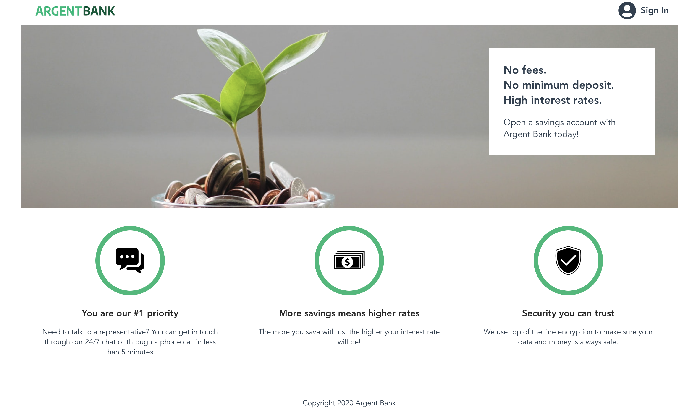

# 🏦 ArgentBank – Frontend Application



ArgentBank is a modern banking web application built with React and Redux Toolkit.
It allows users to authenticate, view their profile, and update their personal information.

---

## 🚀 Features

- 🔐 User authentication (login/logout)
- 👤 Profile display (first name / last name)
- ✏️ Profile update (edit user information)
- 💾 Token persistence (localStorage / sessionStorage)
- ⚡ Global state management with Redux Toolkit
- 🔄 API integration with Axios
- 📱 Responsive design
- ♿ Accessibility improvements

---

## 🛠️ Tech Stack

- React (Vite)
- Redux Toolkit
- React Router
- Axios
- SCSS (BEM methodology)
- JWT Authentication

## 📂 Project Structure

```text
ArgentBank/
├── frontend/
│   ├── src/
│   │   ├── components/
│   │   ├── pages/
│   │   ├── hooks/
│   │   ├── store/
│   │   ├── service/
│   │   ├── styles/
│   │   └── main.jsx
│   └── package.json
├── backend/
│   └── API server
└── README.md
```

## ⚙️ Installation

### Clone the repository

git clone https://github.com/DanickDela/ArgentBank.git
cd ArgentBank

### Install dependencies

Frontend:
cd frontend
npm install

Backend:
cd ../backend
npm install

---

## ▶️ Run the project

Backend:
npm run dev:server

Frontend:
cd ../frontend
npm run dev

---

## 🔐 Authentication Flow

1. Login
2. Token stored (localStorage/sessionStorage)
3. Redux updated
4. Profile fetched
5. Protected routes secured

---

## 🔄 State Management

authSlice
Stores JWT token
userSlice
Stores user profile
Handles async fetch (createAsyncThunk)
Manages status (idle, loading, succeeded, failed)

## 📡 API Endpoints

Base URL:
http://localhost:3001/api/v1

| Endpoint        | Method | Description    |
| --------------- | ------ | -------------- |
| `/user/login`   | POST   | Login user     |
| `/user/signup`  | POST   | Register user  |
| `/user/profile` | POST   | Get profile    |
| `/user/profile` | PUT    | Update profile |

---

## 🎨 Styling

SCSS modular structure
BEM methodology
Responsive design

## 🧠 Key Concepts

React Hooks (useState, useEffect)
Custom Hooks (useLoginUser, useUpdateUser)
Redux global state management
API error handling
Protected routes
Form validation

## 👨‍💻 Author

Danick Delaroche
